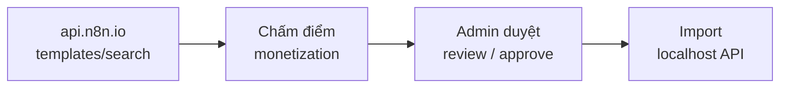

# Trending Workflows — Import từ n8n.io vào localhost

Công cụ CLI giúp admin:

1. Lấy workflow **trending** từ [n8n Templates API](https://api.n8n.io/api/)
2. Xếp hạng theo **tiềm năng kiếm tiền** (monetization score)
3. **Duyệt** workflow muốn dùng
4. **Import** vào instance n8n local (localhost)

Script: [`trending-workflows.mjs`](./trending-workflows.mjs)

## Luồng làm việc



## Yêu cầu

- Node.js ≥ 22 (theo repo)
- Kết nối internet (gọi `api.n8n.io`)
- Để **import**: n8n local đang chạy và có API key

Khởi động n8n local:

```bash
pnpm dev:services   # Postgres + Redis (tùy chọn)
cd packages/cli && pnpm dev
```

Tạo API key: **Settings → n8n API → Create an API key**

## Lệnh nhanh

| Lệnh | Mô tả |
|------|--------|
| `pnpm trending:fetch` | Lấy trending, chấm điểm, lưu danh sách ứng viên |
| `pnpm trending:list` | In danh sách đã xếp hạng ra terminal |
| `pnpm trending:report` | Tạo báo cáo HTML (mở trong browser) |
| `pnpm trending:review` | Duyệt tương tác: `y` approve / `n` reject / `s` skip |
| `pnpm trending:approve <id>…` | Approve trực tiếp theo template ID |
| `pnpm trending:open` | In URL import — mở browser khi đã login (dễ nhất) |
| `pnpm trending:setup` | Login 1 lần, tự tạo API key, lưu `local.env` |
| `pnpm trending:import` | Import qua API (cần API key hoặc đã chạy setup) |

### Ví dụ end-to-end

```bash
# 1. Lấy workflow trending
pnpm trending:fetch

# 2. Xem kết quả
pnpm trending:list
open .trending-workflows/report.html

# 3. Duyệt
pnpm trending:review
# hoặc:
pnpm trending:approve 4827

# 4. Import — chọn 1 trong 3 cách:

# Cách A (dễ nhất — đã login browser):
pnpm trending:open
# → mở URL in ra, n8n tự import template

# Cách B (CLI tự setup API key, chỉ cần email/password 1 lần):
pnpm trending:setup
pnpm trending:import

# Cách C (tự tạo API key trong UI):
# Settings → n8n API → Create API key
echo 'N8N_LOCAL_API_KEY=n8n_api_xxx' >> .trending-workflows/local.env
pnpm trending:import
```

## Biến môi trường

| Biến | Mặc định | Mô tả |
|------|----------|--------|
| `N8N_TEMPLATES_HOST` | `https://api.n8n.io/api/` | Host Templates API |
| `N8N_LOCAL_URL` | `http://localhost:5678` | URL instance local |
| `N8N_LOCAL_API_KEY` | *(khi import qua API)* | API key — tạo thủ công hoặc qua `pnpm trending:setup` |
| `N8N_EMAIL` | *(khi dùng setup)* | Email đăng nhập n8n local |
| `N8N_PASSWORD` | *(khi dùng setup)* | Mật khẩu n8n local |
| `TRENDING_ROWS` | `40` | Số workflow lấy mỗi lần fetch |
| `TRENDING_MIN_SCORE` | `35` | Ngưỡng điểm tối thiểu (0–100) |

Ví dụ lọc chặt hơn:

```bash
TRENDING_ROWS=60 TRENDING_MIN_SCORE=50 pnpm trending:fetch
```

## Cách chấm điểm (monetization score)

Điểm tổng tối đa **100**, cộng dồn từ các tín hiệu:

| Tín hiệu | Điểm (ước lượng) |
|----------|------------------|
| Vị trí trending | Top list → tối đa +25 |
| Lượt xem (`totalViews`) | Log scale → tối đa +15 |
| Category “có thể bán dịch vụ” | Sales, Lead Generation, CRM, Support Chatbot, AI RAG… |
| Node AI (LangChain, OpenAI…) | +3 / node, tối đa +12 |
| Creator verified | +5 |
| Từ khóa trong tên/mô tả | lead, sales, crm, chatbot, seo… → tối đa +10 |

Chỉ workflow có score ≥ `TRENDING_MIN_SCORE` mới vào danh sách ứng viên.

## API n8n.io được dùng

| Endpoint | Mục đích |
|----------|----------|
| `GET /templates/search?sort=trendingScore:desc,rank:desc` | Danh sách trending |
| `GET /templates/workflows/{id}` | Metadata + categories |
| `GET /workflows/templates/{id}` | Full workflow JSON để import |

Tham khảo implementation trong repo: `packages/frontend/@n8n/rest-api-client/src/api/templates.ts`

## File dữ liệu (`.trending-workflows/`)

Thư mục này được gitignore — chỉ lưu local:

| File | Nội dung |
|------|----------|
| `candidates.json` | Danh sách ứng viên sau fetch + scoring |
| `approved.json` | Workflow admin đã approve / reject |
| `report.html` | Báo cáo HTML để xem nhanh |
| `import-log.json` | Log kết quả import lần cuối |

## Import vào localhost

Script gọi Public API:

```http
POST /api/v1/workflows
X-N8N-API-KEY: <N8N_LOCAL_API_KEY>
```

Workflow được tạo với:

- `active: false` (chưa kích hoạt)
- Mỗi lần import tạo **workflow mới** — không ghi đè bản cũ
- Dùng **một cách** import: hoặc `pnpm trending:open` (browser), hoặc `pnpm trending:import` (CLI)
- Script skip template đã có trong `import-log.json`

Sau import, mở workflow trong UI, gắn credentials và test trước khi activate.

## Lưu ý

- Một số template dùng **community nodes** — cần cài node tương ứng trên self-hosted.
- Template miễn phí (`price=0`) — script không lấy template trả phí.
- Điểm monetization là **heuristic nội bộ**, không phải metric chính thức của n8n.
- Chỉ import workflow bạn có quyền sử dụng; tuân thủ license/terms của từng template.

## Mở rộng (đề xuất)

- Lọc theo category cố định (Sales, Lead Generation…)
- UI admin trong editor-ui thay cho CLI
- Cron fetch định kỳ + thông báo workflow mới trending
- Tích hợp folder/project cụ thể khi import
